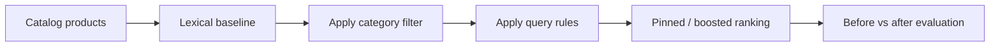

# catalog-search-query-rules-lab

## Português

`catalog-search-query-rules-lab` é um laboratório de busca de catálogo com foco em **query rules** no contexto de `Elasticsearch`. O projeto foi pensado para mostrar como regras explícitas e auditáveis podem complementar um ranking lexical, principalmente em cenários de merchandising, campanhas e priorização controlada.

### Storytelling técnico

Sistemas de busca de catálogo normalmente começam com uma camada lexical forte. Isso resolve boa parte das consultas, mas não resolve tudo. Em ambientes reais, sempre aparecem situações em que o produto precisa intervir no ranking:

- uma campanha quer fixar um SKU no topo;
- uma coleção precisa ganhar destaque para certo contexto de busca;
- um conjunto de produtos promocionados precisa subir em queries específicas;
- uma decisão comercial precisa ser aplicada com clareza, sem depender de re-treinar modelos.

Esse é o espaço natural das `query rules`. Elas não substituem o mecanismo de busca, mas acrescentam uma camada de **controle explícito**, útil quando a decisão precisa ser:

- previsível;
- governável;
- fácil de explicar;
- simples de desligar ou ajustar.

O laboratório mostra exatamente essa arquitetura:

- baseline lexical sem regras;
- aplicação de regras controladas;
- comparação antes vs depois;
- medição objetiva do ganho.

### O que o projeto faz

O pipeline:

1. gera um catálogo sintético de produtos;
2. gera cenários de busca com SKU esperado;
3. gera os arquivos de settings, mappings e regras;
4. executa um baseline lexical;
5. aplica as query rules sobre o ranking filtrado;
6. compara o topo do ranking antes e depois;
7. registra os artefatos do experimento.

### Arquitetura do repositório

- [src/sample_data.py](/Users/flaviagaia/Documents/CV_FLAVIA_CODEX/catalog-search-query-rules-lab/src/sample_data.py)  
  Gera o catálogo, os cenários, as regras e a configuração do índice.
- [src/modeling.py](/Users/flaviagaia/Documents/CV_FLAVIA_CODEX/catalog-search-query-rules-lab/src/modeling.py)  
  Executa o benchmark antes e depois das regras.
- [main.py](/Users/flaviagaia/Documents/CV_FLAVIA_CODEX/catalog-search-query-rules-lab/main.py)  
  Roda o pipeline ponta a ponta.
- [tests/test_project.py](/Users/flaviagaia/Documents/CV_FLAVIA_CODEX/catalog-search-query-rules-lab/tests/test_project.py)  
  Garante o contrato mínimo do experimento.
- [query_rules_examples.json](/Users/flaviagaia/Documents/CV_FLAVIA_CODEX/catalog-search-query-rules-lab/query_rules/query_rules_examples.json)  
  Registra a estrutura das regras e suas ações.
- [products_index_settings.json](/Users/flaviagaia/Documents/CV_FLAVIA_CODEX/catalog-search-query-rules-lab/index_configs/products_index_settings.json)  
  Define analyzer e normalizer do índice.
- [products_index_mappings.json](/Users/flaviagaia/Documents/CV_FLAVIA_CODEX/catalog-search-query-rules-lab/index_configs/products_index_mappings.json)  
  Define a estrutura do documento de catálogo.

### Pipeline conceitual

## Índice e mappings

### Settings do índice

Arquivo:

- [products_index_settings.json](/Users/flaviagaia/Documents/CV_FLAVIA_CODEX/catalog-search-query-rules-lab/index_configs/products_index_settings.json)

O projeto define:

- `catalog_text_analyzer`
  analyzer textual principal;
- `lowercase_normalizer`
  normalizer para campos `keyword`.

Função prática:

- manter matching textual consistente em `title` e `description`;
- garantir filtros exatos estáveis em `brand`, `category` e `collection`.

### Mappings do índice

Arquivo:

- [products_index_mappings.json](/Users/flaviagaia/Documents/CV_FLAVIA_CODEX/catalog-search-query-rules-lab/index_configs/products_index_mappings.json)

Campos principais:

- `sku`
  `keyword` para identificação exata.
- `title`
  `text` para matching lexical principal.
- `description`
  `text` para ampliar cobertura.
- `brand`
  `keyword` para filtros e facets.
- `category`
  `keyword` para filtros por vertical.
- `price`
  `scaled_float` para filtros e ordenação.
- `popularity_score`
  `float` para sinal estatístico do produto.
- `is_promoted`
  `boolean` para regras promocionais.
- `collection`
  `keyword` para boosts temáticos.

### Por que esse mapping é bom para query rules

Porque ele separa bem:

- o que entra no matching textual;
- o que funciona como filtro exato;
- o que serve como sinal de negócio;
- o que pode ser alvo explícito de regra.

Essa separação é importante porque regras costumam operar justamente sobre campos estáveis e previsíveis.

## Dataset local

Arquivos:

- [catalog_products.csv](/Users/flaviagaia/Documents/CV_FLAVIA_CODEX/catalog-search-query-rules-lab/data/raw/catalog_products.csv)
- [query_scenarios.csv](/Users/flaviagaia/Documents/CV_FLAVIA_CODEX/catalog-search-query-rules-lab/data/raw/query_scenarios.csv)

### Estrutura do catálogo

Cada produto contém:

- `sku`
- `title`
- `description`
- `brand`
- `category`
- `price`
- `popularity_score`
- `is_promoted`
- `collection`

### Estrutura dos cenários

Cada cenário contém:

- `scenario_id`
- `query_text`
- `category_filter`
- `expected_sku`

O papel desses cenários é permitir que o experimento responda uma pergunta simples:

- o ranking colocou o SKU esperado em primeiro?

## Estrutura das query rules

Arquivo:

- [query_rules_examples.json](/Users/flaviagaia/Documents/CV_FLAVIA_CODEX/catalog-search-query-rules-lab/query_rules/query_rules_examples.json)

### Modelo da regra

Cada regra tem:

- `rule_id`
- `condition`
- `action`

### O que entra em `condition`

No laboratório atual:

- `query_contains_any`
  lista de termos que ativam a regra;
- `category`
  vertical em que a regra pode atuar.

### O que entra em `action`

No laboratório atual:

- `pin_sku`
  fixa um SKU no topo;
- `boost_collection`
  aumenta score de uma coleção;
- `boost_promoted`
  dá boost para itens promocionados;
- `boost_value`
  intensidade do ajuste.

Esse formato foi escolhido porque é simples de ler e muito próximo da lógica que costuma aparecer em sistemas de regras de busca.

## Regras atuais

### `pin_sony_for_wireless_headphones`

Quando a query contém `wireless` e `headphones` dentro da categoria `audio`, a regra fixa `SKU-1001` no topo.

Objetivo:

- simular pinning explícito para um cenário de merchandising ou destaque de campanha.

### `pin_garmin_for_running`

Quando a query contém `running`, `runner` ou `training` em `wearables`, a regra fixa `SKU-1006`.

Objetivo:

- simular priorização explícita para contexto esportivo.

### `boost_office_keyboard`

Quando a query fala de `office` ou `productivity` em `computer_accessories`, a regra aumenta o score da coleção `office`.

Objetivo:

- mostrar um caso de boost leve, sem pinning.

### `boost_promoted_audio`

Quando a query envolve `headphones` ou `audio`, a regra adiciona boost aos produtos promocionados.

Objetivo:

- simular uma política simples de promoção controlada.

## Técnicas utilizadas

### 1. Baseline lexical

O projeto usa `TF-IDF + cosine similarity` como baseline de recuperação textual.

Papel:

- estabelecer o ranking inicial;
- permitir comparação limpa com a camada de regras.

### 2. Filtro de categoria

Antes de aplicar regras, o benchmark restringe os resultados à categoria esperada.

Papel:

- aproximar a navegação real por vertical;
- garantir que a regra atue dentro do contexto correto.

### 3. Query rules

As regras entram depois do ranking lexical e depois do filtro de categoria.

Elas podem:

- fixar SKU;
- aumentar score por coleção;
- aumentar score de itens promocionados.

Isso é importante porque mostra a camada de regras como uma etapa de **intervenção controlada**, não como substituição do retrieval.

## Estratégia de modelagem

O pipeline executa:

1. leitura do catálogo e dos cenários;
2. vetorização textual do catálogo;
3. cálculo do ranking lexical base;
4. aplicação do filtro de categoria;
5. aplicação das regras sobre o score filtrado;
6. geração do ranking final com regras;
7. comparação entre baseline e ranking ajustado.

## Métricas

O benchmark usa:

- `baseline_hit_rate_at_1`
- `rules_hit_rate_at_1`
- `improvement`

### O que cada métrica responde

#### `baseline_hit_rate_at_1`

Quanto o baseline puro acerta no topo do ranking.

#### `rules_hit_rate_at_1`

Quanto o ranking com regras acerta no topo.

#### `improvement`

Quanto a camada de regras melhorou o topo do ranking em relação ao baseline.

## Resultados atuais

- `dataset_source = catalog_query_rules_sample`
- `product_count = 8`
- `scenario_count = 4`
- `baseline_hit_rate_at_1 = 0.75`
- `rules_hit_rate_at_1 = 1.0`
- `improvement = 0.25`

### Interpretação dos resultados

O laboratório mostra um ganho real da camada de query rules:

- sem regras, o baseline acerta `75%` dos cenários no topo;
- com regras, o acerto sobe para `100%`;
- o ganho líquido do experimento é `0.25`.

Esse resultado é importante porque mostra exatamente o papel desse tipo de camada:

- corrigir casos em que o lexical puro não entrega a decisão desejada;
- fazer isso de forma explícita e auditável;
- medir o impacto da intervenção sem alterar todo o sistema.

## Artefatos gerados

- [baseline_results.csv](/Users/flaviagaia/Documents/CV_FLAVIA_CODEX/catalog-search-query-rules-lab/data/processed/baseline_results.csv)
- [rules_results.csv](/Users/flaviagaia/Documents/CV_FLAVIA_CODEX/catalog-search-query-rules-lab/data/processed/rules_results.csv)
- [query_rules_lab_report.json](/Users/flaviagaia/Documents/CV_FLAVIA_CODEX/catalog-search-query-rules-lab/data/processed/query_rules_lab_report.json)
- [query_rules_examples.json](/Users/flaviagaia/Documents/CV_FLAVIA_CODEX/catalog-search-query-rules-lab/query_rules/query_rules_examples.json)

### Como ler os artefatos

`baseline_results.csv`:

- mostra o ranking vencedor sem regras.

`rules_results.csv`:

- mostra o ranking vencedor depois da aplicação das regras.

`query_rules_lab_report.json`:

- consolida as métricas do experimento.

## Limitações atuais

- o projeto não conecta em um cluster Elasticsearch real;
- a recuperação lexical é uma aproximação local leve;
- o catálogo ainda é pequeno;
- as regras são demonstrativas e controladas.

## Próximos passos naturais

- conectar a um Elasticsearch real;
- usar a API nativa de `query rules`;
- ampliar o benchmark com mais cenários;
- medir `MRR` e `NDCG`;
- combinar query rules com busca vetorial;
- segmentar regras por campanha, sazonalidade ou merchant.

## English

`catalog-search-query-rules-lab` is a catalog search lab focused on Elasticsearch-style query rules. It demonstrates how explicit and auditable rule layers can complement a lexical ranking pipeline.

### What It Shows

- lexical baseline ranking;
- explicit business rules;
- SKU pinning;
- collection boosts;
- promotional boosts;
- before-versus-after evaluation.

### Current Results

- `dataset_source = catalog_query_rules_sample`
- `product_count = 8`
- `scenario_count = 4`
- `baseline_hit_rate_at_1 = 0.75`
- `rules_hit_rate_at_1 = 1.0`
- `improvement = 0.25`
