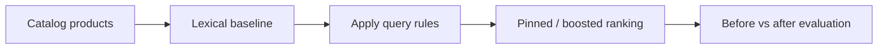

# catalog-search-query-rules-lab

## Português

`catalog-search-query-rules-lab` é um laboratório de busca de catálogo com foco em **query rules** no contexto de `Elasticsearch`. O objetivo do projeto é mostrar que, em determinadas situações, uma camada explícita de regras controladas pode melhorar a experiência de busca de forma auditável e previsível.

### Storytelling técnico

Nem toda decisão de ranking em catálogo deve depender apenas de relevância estatística. Existem contextos em que o produto precisa de controle explícito:

- uma campanha quer empurrar um SKU específico;
- uma vertical quer favorecer uma coleção;
- uma query precisa ter pinning de um item-chave;
- uma regra comercial deve ser aplicada com transparência.

É justamente aí que entram as `query rules`. Elas não substituem a camada de recuperação textual, mas funcionam como uma camada controlada que intervém no ranking quando o produto precisa disso.

Este projeto mostra exatamente esse desenho:

- um **baseline lexical sem regras**;
- uma **camada de regras explícitas**;
- comparação **antes vs depois**;
- medição do impacto no topo do ranking.

### O que o projeto faz

O pipeline:

1. gera um catálogo sintético de produtos;
2. gera cenários de busca com SKU esperado;
3. cria arquivos de settings, mappings e regras;
4. executa um baseline lexical;
5. aplica query rules sobre o baseline;
6. mede o ganho no `Hit Rate@1`.

### Arquitetura do repositório

- [src/sample_data.py](/Users/flaviagaia/Documents/CV_FLAVIA_CODEX/catalog-search-query-rules-lab/src/sample_data.py)  
  Gera o catálogo, os cenários, as regras e a configuração do índice.
- [src/modeling.py](/Users/flaviagaia/Documents/CV_FLAVIA_CODEX/catalog-search-query-rules-lab/src/modeling.py)  
  Executa o benchmark antes e depois das regras.
- [main.py](/Users/flaviagaia/Documents/CV_FLAVIA_CODEX/catalog-search-query-rules-lab/main.py)  
  Roda o pipeline ponta a ponta.
- [tests/test_project.py](/Users/flaviagaia/Documents/CV_FLAVIA_CODEX/catalog-search-query-rules-lab/tests/test_project.py)  
  Garante o contrato mínimo e que as regras não pioram o experimento.
- [query_rules_examples.json](/Users/flaviagaia/Documents/CV_FLAVIA_CODEX/catalog-search-query-rules-lab/query_rules/query_rules_examples.json)  
  Registra as regras do laboratório.
- [products_index_settings.json](/Users/flaviagaia/Documents/CV_FLAVIA_CODEX/catalog-search-query-rules-lab/index_configs/products_index_settings.json)  
  Define analyzer e normalizer do índice.
- [products_index_mappings.json](/Users/flaviagaia/Documents/CV_FLAVIA_CODEX/catalog-search-query-rules-lab/index_configs/products_index_mappings.json)  
  Define a estrutura do documento de catálogo.

### Pipeline conceitual

## Índice e mappings

### Settings do índice

Arquivo:

- [products_index_settings.json](/Users/flaviagaia/Documents/CV_FLAVIA_CODEX/catalog-search-query-rules-lab/index_configs/products_index_settings.json)

O projeto define:

- `catalog_text_analyzer`
  analyzer textual principal;
- `lowercase_normalizer`
  normalizer para campos `keyword`.

Função:

- permitir matching textual consistente;
- garantir filtros exatos estáveis em `brand`, `category` e `collection`.

### Mappings do índice

Arquivo:

- [products_index_mappings.json](/Users/flaviagaia/Documents/CV_FLAVIA_CODEX/catalog-search-query-rules-lab/index_configs/products_index_mappings.json)

Campos principais:

- `sku`
  `keyword` para identificação exata.
- `title`
  `text` para matching principal.
- `description`
  `text` para ampliar cobertura lexical.
- `brand`
  `keyword` com normalizer.
- `category`
  `keyword` com normalizer.
- `price`
  `scaled_float` para filtros/ordenação.
- `popularity_score`
  `float` como sinal estatístico.
- `is_promoted`
  `boolean` para intervenção promocional.
- `collection`
  `keyword` para regras por coleção.

### Por que esse mapping funciona para query rules

Porque ele separa bem:

- o que é recuperado por texto;
- o que é filtrado por chave;
- o que é sinal numérico;
- o que pode ser alvo explícito de regras.

Query rules funcionam melhor quando o índice foi modelado para isso.

## Dataset local

Arquivos:

- [catalog_products.csv](/Users/flaviagaia/Documents/CV_FLAVIA_CODEX/catalog-search-query-rules-lab/data/raw/catalog_products.csv)
- [query_scenarios.csv](/Users/flaviagaia/Documents/CV_FLAVIA_CODEX/catalog-search-query-rules-lab/data/raw/query_scenarios.csv)

### Estrutura do catálogo

Cada produto contém:

- `sku`
- `title`
- `description`
- `brand`
- `category`
- `price`
- `popularity_score`
- `is_promoted`
- `collection`

### Estrutura dos cenários

Cada cenário contém:

- `scenario_id`
- `query_text`
- `category_filter`
- `expected_sku`

Isso permite medir se o ranking entrega o SKU correto em primeiro lugar.

## Query rules do laboratório

Arquivo:

- [query_rules_examples.json](/Users/flaviagaia/Documents/CV_FLAVIA_CODEX/catalog-search-query-rules-lab/query_rules/query_rules_examples.json)

### Regras atuais

#### `pin_sony_for_wireless_headphones`

Quando a query contém termos como `wireless` e `headphones` dentro da categoria `audio`, a regra fixa `SKU-1001` no topo.

Objetivo:

- simular pinning controlado em cenário promocional ou de merchandising.

#### `pin_garmin_for_running`

Quando a query contém `running`, `runner` ou `training` em `wearables`, a regra fixa `SKU-1006`.

Objetivo:

- simular priorização explícita em contexto esportivo.

#### `boost_office_keyboard`

Quando a query fala de `office` ou `productivity` em `computer_accessories`, a regra aumenta o score da coleção `office`.

Objetivo:

- simular uma intervenção mais leve que pinning.

#### `boost_promoted_audio`

Quando a query envolve `headphones` ou `audio`, a regra adiciona boost aos produtos promocionados.

Objetivo:

- aproximar um cenário de merchandising controlado.

## Técnicas utilizadas

### 1. Baseline lexical

O projeto usa `TF-IDF + cosine similarity` como baseline leve de recuperação textual.

Papel:

- estabelecer um ranking inicial sem regras;
- permitir comparação limpa com a versão ajustada.

### 2. Filtro de categoria

Antes de aplicar as regras, o benchmark restringe o ranking à categoria esperada.

Papel:

- aproximar a navegação real por vertical;
- evitar comparar produtos estruturalmente fora do contexto.

### 3. Query rules

As regras entram depois do baseline lexical.

Elas podem:

- fixar um SKU no topo;
- adicionar boost por coleção;
- adicionar boost a produtos promocionados.

Isso mostra o papel clássico das `query rules`:

- controlar exceções;
- orientar merchandising;
- introduzir governança de ranking.

## Estratégia de modelagem

O pipeline executa:

1. leitura do catálogo e dos cenários;
2. vetorização textual do catálogo;
3. cálculo do ranking lexical base;
4. aplicação de filtro de categoria;
5. aplicação das query rules sobre o score já filtrado;
6. comparação entre ranking baseline e ranking com regras;
7. cálculo do ganho no topo do ranking.

## Métrica de avaliação

O benchmark usa:

- `baseline_hit_rate_at_1`
- `rules_hit_rate_at_1`
- `improvement`

### O que essas métricas respondem

- o baseline lexical colocou o SKU esperado em primeiro?
- a camada de query rules melhorou isso?
- qual foi o ganho líquido no topo do ranking?

## Resultados atuais

- `dataset_source = catalog_query_rules_sample`
- `product_count = 8`
- `scenario_count = 4`
- `baseline_hit_rate_at_1 = 0.75`
- `rules_hit_rate_at_1 = 1.0`
- `improvement = 0.25`

### Interpretação dos resultados

O laboratório mostra um ganho real da camada de regras:

- sem regras, o baseline acerta `75%` dos cenários no topo;
- com regras, o acerto sobe para `100%`.

Esse resultado é importante porque mostra exatamente o valor do projeto:

- nem sempre o ranking lexical puro entrega a decisão de produto desejada;
- regras explícitas conseguem corrigir isso de forma transparente;
- o efeito da intervenção é mensurável.

## Artefatos gerados

- [baseline_results.csv](/Users/flaviagaia/Documents/CV_FLAVIA_CODEX/catalog-search-query-rules-lab/data/processed/baseline_results.csv)
- [rules_results.csv](/Users/flaviagaia/Documents/CV_FLAVIA_CODEX/catalog-search-query-rules-lab/data/processed/rules_results.csv)
- [query_rules_lab_report.json](/Users/flaviagaia/Documents/CV_FLAVIA_CODEX/catalog-search-query-rules-lab/data/processed/query_rules_lab_report.json)
- [query_rules_examples.json](/Users/flaviagaia/Documents/CV_FLAVIA_CODEX/catalog-search-query-rules-lab/query_rules/query_rules_examples.json)

## Limitações atuais

- o projeto não conecta em um cluster Elasticsearch real;
- a recuperação lexical é uma aproximação local leve;
- o catálogo ainda é pequeno;
- as regras são demonstrativas.

## Próximos passos naturais

- conectar o índice a um Elasticsearch real;
- usar a API nativa de `query rules`;
- ampliar o benchmark com mais cenários;
- medir `MRR` e `NDCG`;
- combinar query rules com busca vetorial;
- separar regras por campanha, sazonalidade ou merchant.

## English

`catalog-search-query-rules-lab` is a catalog search lab focused on Elasticsearch-style query rules. It demonstrates:

- lexical baseline ranking;
- explicit business rules;
- pinning;
- controlled boosts;
- before-versus-after evaluation.

### Current Results

- `dataset_source = catalog_query_rules_sample`
- `product_count = 8`
- `scenario_count = 4`
- `baseline_hit_rate_at_1 = 0.75`
- `rules_hit_rate_at_1 = 1.0`
- `improvement = 0.25`
